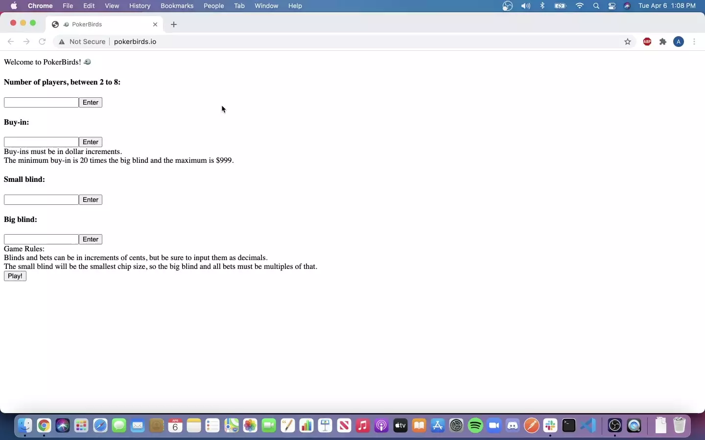

# PokerBirds 🐦

http://pokerbirds.io

> Online Poker Game for up to 8 players.
Created with React, Node, Mongo, and Express.
Deployed with Docker & Linode



Card Graphics created by cardsJS:
 - https://github.com/richardschneider/cardsJS
 - http://richardschneider.github.io/cardsJS/

## Installation for Local Use

From within the root directory:

```sh
npm install
npm build
npm start
```

In database/index.js, uncomment the first mongoose connection line and comment out the second mongoose connection line.

Begin a game session at http://localhost:3000/:gameId

For command line game written in node, run node nodeGame/game.js

## Dependencies

MongoDB
